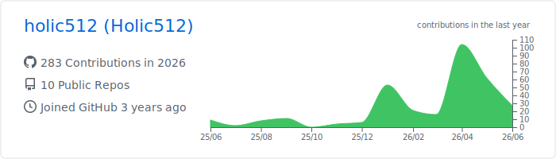
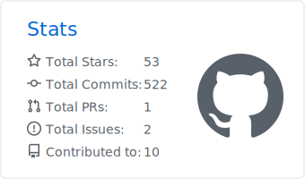
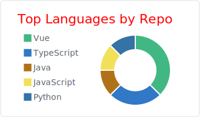
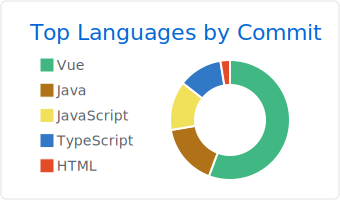

<!--
  Minimalist Profile README
  Direction: monochrome, card-based, screenshot-inspired.
  Palette: #000000 | #ffffff | #333333 | #e5e5e5
-->

  

<h1 align="center">holic512</h1>

  <strong>Software engineering, full-stack development, and practical automation.</strong>

  <code>Clean code.</code>&nbsp;&nbsp;
  <code>Clear systems.</code>&nbsp;&nbsp;
  <code>Useful tools.</code>

  
  
  
  

 

<table>
  <tr>
    <td width="56%" valign="top">
      <h3>ABOUT</h3>
      

        I use this profile to track programming practice, project experiments,
        and engineering notes. My current public stack centers on web development,
        backend fundamentals, automation scripts, and course/project implementations.
      

    </td>
    <td width="44%" valign="top">
      <table>
        <tr>
          <td><strong>Focus</strong></td>
          <td>Full-stack development, backend services, automation, and software engineering practice.</td>
        </tr>
        <tr>
          <td><strong>Working style</strong></td>
          <td>Readable structure, explicit naming, small iterations, and verifiable results.</td>
        </tr>
        <tr>
          <td><strong>Profile theme</strong></td>
          <td>Minimal black-and-white layout with GitHub activity cards.</td>
        </tr>
      </table>
    </td>
  </tr>
</table>

## TECH STACK

<table>
  <tr>
    <td width="150"><strong>Languages</strong></td>
    <td>
      
      
      
      
      
      
    </td>
  </tr>
  <tr>
    <td><strong>Frontend</strong></td>
    <td>
      
      
      
      
      
      
    </td>
  </tr>
  <tr>
    <td><strong>Tools & Platform</strong></td>
    <td>
      
      
      
      
    </td>
  </tr>
</table>

## GITHUB ACTIVITY

  

<table>
  <tr>
    <td width="33%" align="center">
      
    </td>
    <td width="33%" align="center">
      
    </td>
    <td width="33%" align="center">
      
    </td>
  </tr>
</table>

<table>
  <tr>
    <td width="52%" valign="top">
      <h3>ENGINEERING NOTES</h3>
      <ul>
        <li>Keep code paths searchable and responsibilities explicit.</li>
        <li>Prefer small, reviewable changes over large rewrites.</li>
        <li>Verify behavior with real commands, screenshots, or generated artifacts.</li>
        <li>Treat README, workflows, and assets as part of the product surface.</li>
      </ul>
    </td>
    <td width="48%" valign="top">
      <h3>CONTACT</h3>
      <table>
        <tr>
          <td><strong>GitHub</strong></td>
          <td><a href="https://github.com/holic512">@holic512</a></td>
        </tr>
        <tr>
          <td><strong>Bilibili</strong></td>
          <td>holic512</td>
        </tr>
        <tr>
          <td><strong>QQ</strong></td>
          <td>2423580694</td>
        </tr>
      </table>
    </td>
  </tr>
</table>

  

