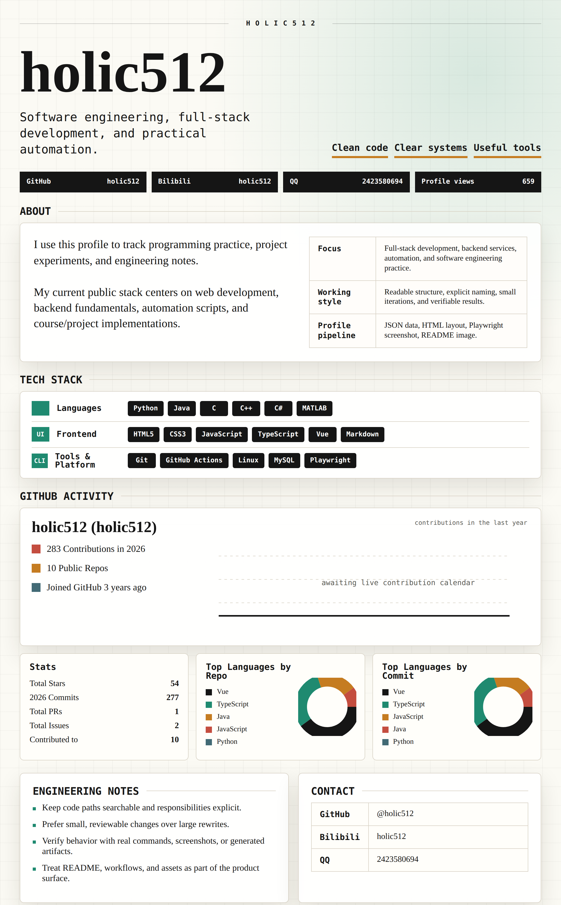
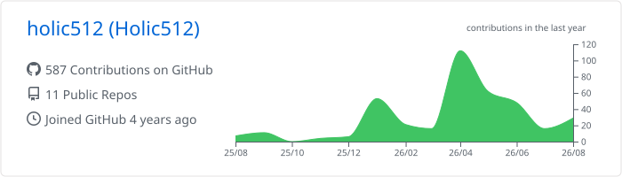
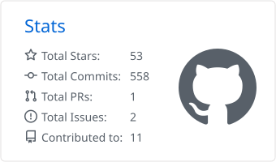
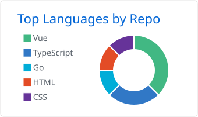

# 你好，我是 holic512 / Hi, I'm holic512

**软件工程 · 全栈开发 · 自动化实践** 
*Software engineering · Full-stack development · Practical automation*

<a href="https://github.com/holic512">GitHub</a> · Bilibili: <code>holic512</code>

  

## 🧭 关于我 / About Me

这里记录我的编程练习、项目实验和工程笔记，并持续沉淀能真正解决问题的实现。 
*This is a living index of programming practice, project experiments, and engineering notes—focused on work that solves real problems.*

- 正在关注全栈开发、后端基础、自动化脚本和软件工程实践。 
  *Currently exploring full-stack development, backend fundamentals, automation scripts, and practical software engineering.*

- 偏好清晰的结构、明确的命名、小步迭代和可验证的交付。 
  *I value readable structure, explicit naming, small iterations, and verifiable results.*

## 🛠️ 技术栈 / Tech Stack

| 方向 / Area | 工具与语言 / Tools & Languages |
| --- | --- |
| 编程语言 Languages | <code>Python</code> <code>Java</code> <code>C</code> <code>C++</code> <code>C#</code> <code>MATLAB</code> |
| 前端开发 Frontend | <code>HTML5</code> <code>CSS3</code> <code>JavaScript</code> <code>TypeScript</code> <code>Vue</code> <code>Markdown</code> |
| 工程工具 Engineering | <code>Git</code> <code>GitHub Actions</code> <code>Linux</code> <code>MySQL</code> <code>Playwright</code> |

## 📊 GitHub 数据 / GitHub Insights

  

  
  

## 🤝 一起交流 / Let's Connect

如果你对仓库中的项目、实现方式或工程实践感兴趣，欢迎通过 [GitHub](https://github.com/holic512) 交流。 
*If a project, implementation detail, or engineering practice here catches your interest, feel free to connect on GitHub.*

用心构建 · 用证据交付 / Build with intent · Ship with evidence

